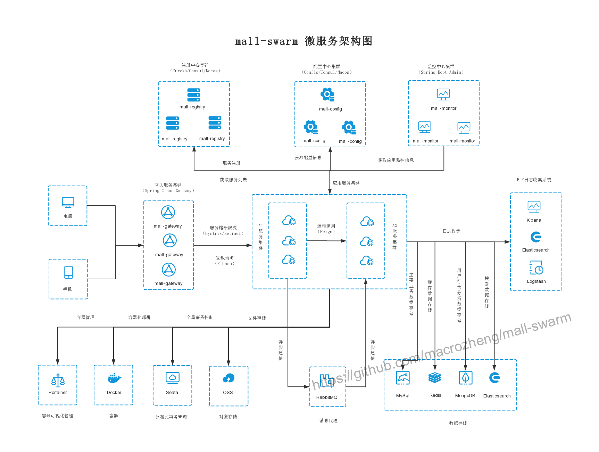

# mall-swarm

<p>
  <a href="#the public"></a>
  <a href="https://github.com/macrozheng/mall"></a>
  <a href="https://github.com/macrozheng/mall-admin-web"></a>
  <a href="#the public"></a>
  <a href="https://gitee.com/macrozheng/mall-swarm"></a>
</p>

## Project Introduction

`mall-swarm`Is a micro service mall system，Adopted Spring Cloud Greenwich、Spring Boot 2、MyBatis、Docker、Elasticsearch and other core technologies, while providing a Vue-based management background to facilitate the rapid construction of the system. `mall-swarm` integrates system functions such as registration center, configuration center, monitoring center, and gateway on the basis of e-commerce business. Complete documentation with a complete set of Spring Cloud tutorials.

## System architecture diagram



## Organizational structure

``` lua
mall
├── mall-common -- Tools and common code modules
├── mall-mbg -- Database operation code module generated by MyBatisGenerator
├── mall-security -- Encapsulating SpringSecurity+JWT Security Certified Module
├── mall-registry -- Eureka-based microservices registry
├── mall-config -- Microservice Configuration Center Based on Spring Cloud Config
├── mall-gateway -- Microservice Cloud API Gateway Service Based on Spring Cloud Gateway
├── mall-monitor -- Microservice monitoring center based on Spring Boot Admin
├── mall-admin -- back-end management system services
├── mall-search -- Product search system service based on Elasticsearch
├── mall-portal -- Mobile terminal mall system services
└── mall-demo -- Microservice remote call test service
```

## Project documentation

- Project documentation`mall`Tutorials：[http://www.macrozheng.com](https://macrozheng.github.io/mall-learning)
- Supporting`Spring Cloud`Tutorials：[https://github.com/macrozheng/springcloud-learning](https://github.com/macrozheng/springcloud-learning)

## Project demo

- Background management system： [http://www.macrozheng.com/admin/index.html](http://www.macrozheng.com/admin/index.html)  
- Mobile terminal mall system：[http://www.macrozheng.com/app/index.html](http://www.macrozheng.com/app/index.html)

## Technology selection

### Back-end technology

| technology             | Description                 | Official website                                                 |
| ---------------- | -------------------- | ---------------------------------------------------- |
| Spring Cloud     | Microservices framework           | https://spring.io/projects/spring-cloud              |
| Spring Boot      | Container + MVC framework         | https://spring.io/projects/spring-boot               |
| Spring Security  | Authentication and authorization framework       | https://spring.io/projects/spring-security           |
| MyBatis          | ORM framework              | http://www.mybatis.org/mybatis-3/zh/index.html       |
| MyBatisGenerator | Data layer code generation       | http://www.mybatis.org/generator/index.html          |
| PageHelper       | MyBatis physical paging plugin  | http://git.oschina.net/free/Mybatis_PageHelper       |
| Swagger-UI       | Document production tools         | https://github.com/swagger-api/swagger-ui            |
| Elasticsearch    | search engine             | https://github.com/elastic/elasticsearch             |
| RabbitMq         | message queue             | https://www.rabbitmq.com/                            |
| Redis            | Distributed cache           | https://redis.io/                                    |
| MongoDb          | NoSql database          | https://www.mongodb.com/                             |
| Docker           | Application container engine         | https://www.docker.com/                              |
| Druid            | Database connection pool         | https://github.com/alibaba/druid                     |
| OSS              | Object store             | https://github.com/aliyun/aliyun-oss-java-sdk        |
| MinIO            | Object store             | https://github.com/minio/minio                       |
| JWT              | JWT login support          | https://github.com/jwtk/jjwt                         |
| LogStash         | Log collection             | https://github.com/logstash/logstash-logback-encoder |
| Lombok           | Simplified Object Packaging Tool     | https://github.com/rzwitserloot/lombok               |
| Seata            | Global transaction management framework     | https://github.com/seata/seata                       |
| Portainer        | Visual Docker container management | https://github.com/portainer/portainer               |
| Jenkins          | 自动化部署工具       | https://github.com/jenkinsci/jenkins                 |

### Front-end technology

| technology       | Description                  | Official website                           |
| ---------- | --------------------- | ------------------------------ |
| Vue        | Front-end framework              | https://vuejs.org/             |
| Vue-router | Routing framework              | https://router.vuejs.org/      |
| Vuex       | Global State Management Framework      | https://vuex.vuejs.org/        |
| Element    | Front-end UI framework            | https://element.eleme.io/      |
| Axios      | Front-end HTTP framework          | https://github.com/axios/axios |
| v-charts   | Charting framework based on Echarts | https://v-charts.js.org/       |


## Environment setup

### Development environment

tool | version number | download
----|----|----
JDK | 1.8 | https://www.oracle.com/technetwork/java/javase/downloads/jdk8-downloads-2133151.html
Mysql | 5.7 | https://www.mysql.com/
Redis | 3.2 | https://redis.io/download
Elasticsearch | 6.2.2 | https://www.elastic.co/downloads
MongoDb | 3.2 | https://www.mongodb.com/download-center
RabbitMq | 3.7.14 | http://www.rabbitmq.com/download.html
Nginx | 1.10 | http://nginx.org/en/download.html

### Build steps

> Windows environment deployment

- Windows environment setup please refer to：[mall-swarm deployment in Windows](http://www.macrozheng.com/#/deploy/mall_swarm_deploy_windows);
- `mall-admin-web`Please refer to the installation and deployment of the project：[Installation and deployment of mall front-end projects](http://www.macrozheng.com/#/deploy/mall_deploy_web);
- `ELK`For the construction of the log collection system, please refer to：[Spring Boot application integrates ELK for log collection](http://www.macrozheng.com/#/technology/mall_tiny_elk);
- Please refer to Min IO for storing files：[Front-end separation project, how to elegantly implement file storage](http://www.macrozheng.com/#/technology/minio_use);
- Read and write separation solution please refer to：[Are you still doing read-write separation in your code? Try this middleware.](http://www.macrozheng.com/#/reference/gaea);
- If you want to use`Consul`As a registration and configuration center, please refer to：[Spring Cloud Consul：Service Governance and Configuration Center](http://www.macrozheng.com/#/cloud/consul);
- If you want to use`Nacos`As a registration and configuration center, please refer to：[Spring Cloud Alibaba: Nacos used as a registry and configuration center](http://www.macrozheng.com/#/cloud/nacos);
- `Distributed transaction` solution please refer to：[Use Seata to completely solve the distributed transaction problem in Spring Cloud!](http://www.macrozheng.com/#/cloud/seata)。

> Docker environment deployment

- Please install CentOS7.6 using a virtual machine.：[Virtual machine installation and use of Linux，It's enough to watch this article！](https://github.com/macrozheng/mall-learning/blob/master/docs/reference/linux_install.md)
- Please refer to the installation of Docker environment：[Essential Docker commands for developers](https://github.com/macrozheng/mall-learning/blob/master/docs/reference/docker.md)；
- Please refer to this project Docker image build：[Building Docker images for SpringBoot applications with Maven plugin](https://github.com/macrozheng/mall-learning/blob/master/docs/reference/docker_maven.md)；
- Please refer to the deployment of this project under Docker container.：[mall-swarm deployment in Linux environment（Based on Docker container）](https://github.com/macrozheng/mall-learning/blob/master/docs/deploy/mall_swarm_deploy_docker.md)。
- This project uses Jenkins to automate：[Automated deployment under microservice architecture，Use Jenkins to achieve！](https://github.com/macrozheng/mall-learning/blob/master/docs/deploy/mall_swarm_deploy_jenkins.md)

## Running effect display

- Registry console information：


- Monitoring Center Application Information：


- Visual container management：


## the public

Mall project full set of learning tutorials in series，**Follow the public**Get it the first time。

Add WeChat group communication，the public background reply**Plus group**Just fine.


## license

[Apache License 2.0](https://github.com/macrozheng/mall-swarm/blob/master/LICENSE)

Copyright (c) 2018-2020 macrozheng