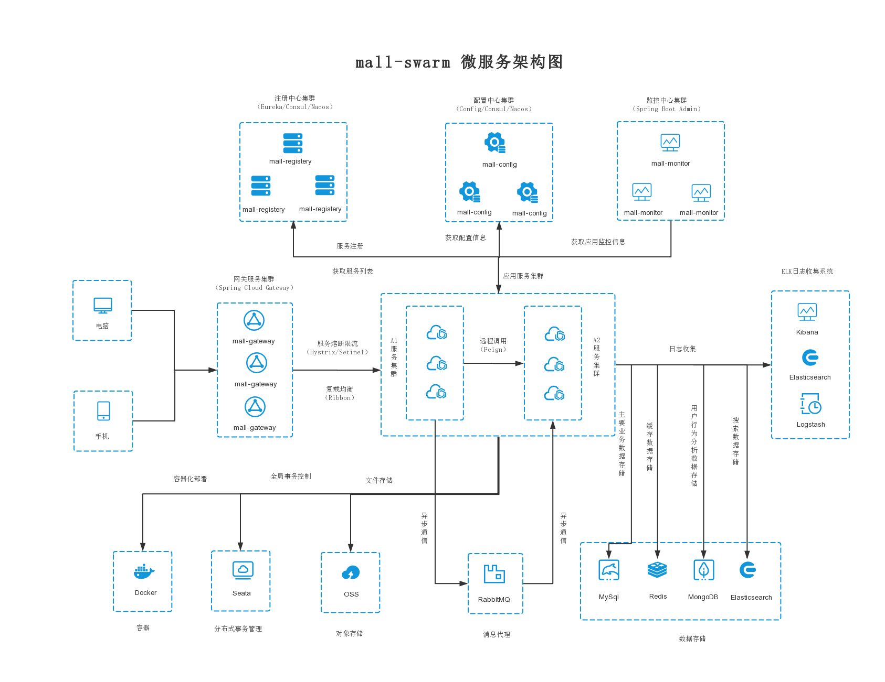
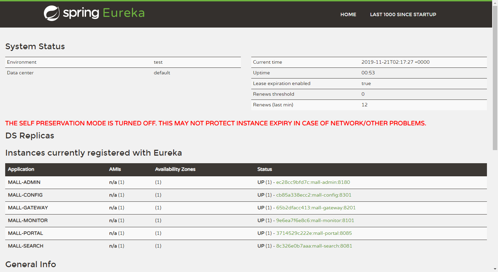
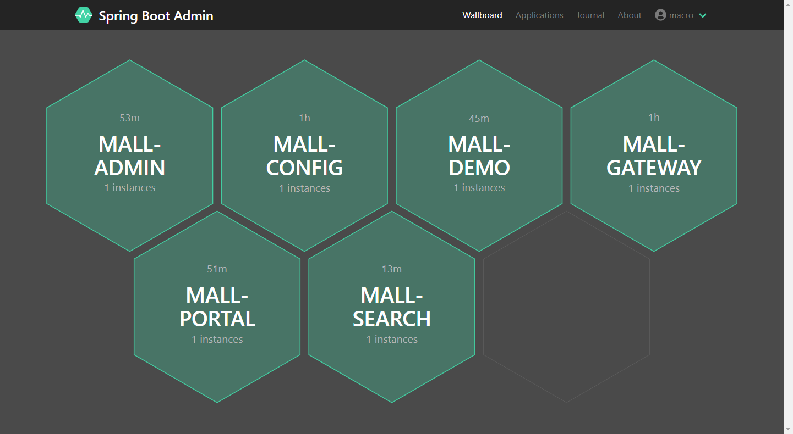
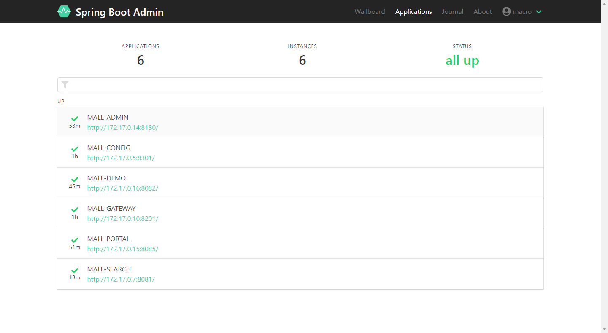
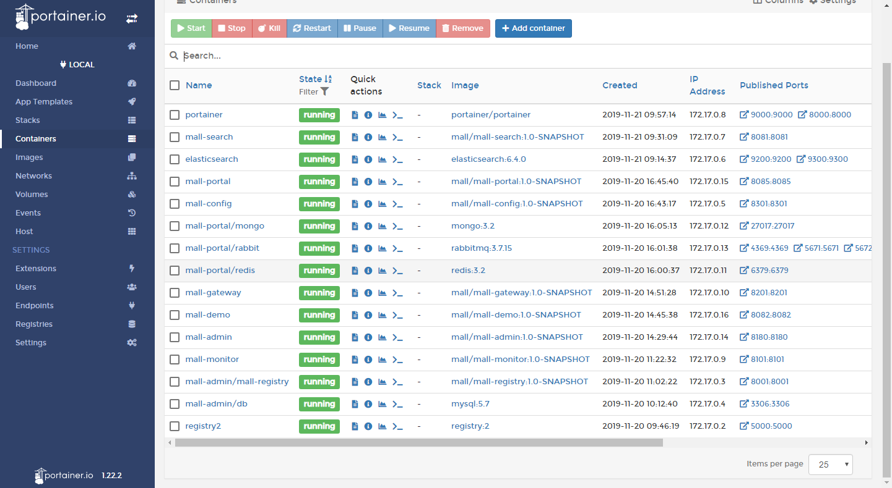
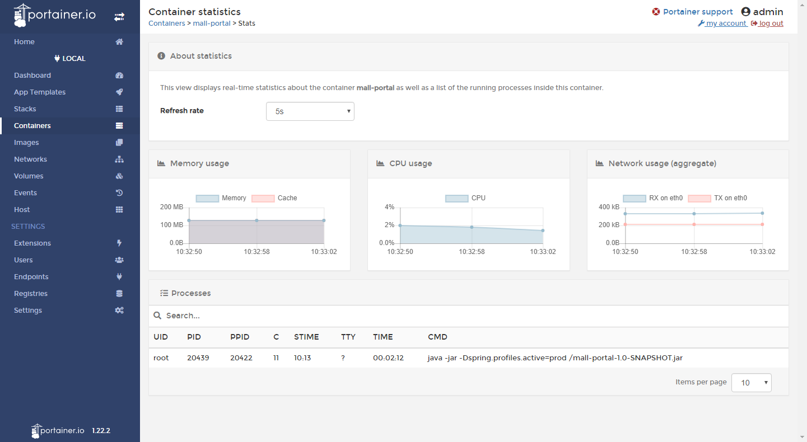

# mall-swarm

<p>
  <a href="#公众号"></a>
  <a href="https://github.com/macrozheng/mall"></a>
  <a href="https://github.com/macrozheng/mall-admin-web"></a>
  <a href="#公众号"></a>
  <a href="https://gitee.com/macrozheng/mall-swarm"></a>
</p>

## 项目介绍

`mall-swarm`是一套微服务商城系统，采用了 Spring Cloud Greenwich、Spring Boot 2、MyBatis、Docker、Elasticsearch等核心技术，同时提供了基于Vue的管理后台方便快速搭建系统。`mall-swarm`在电商业务的基础集成了注册中心、配置中心、监控中心、网关等系统功能。 文档齐全，附带全套Spring Cloud教程。 

## 系统架构图



## 组织结构

``` lua
mall
├── mall-common -- 工具类及通用代码模块
├── mall-mbg -- MyBatisGenerator生成的数据库操作代码模块
├── mall-security -- 封装SpringSecurity+JWT的安全认证的模块
├── mall-registry -- 基于Eureka的微服务注册中心
├── mall-config -- 基于Spring Cloud Config的微服务配置中心
├── mall-gateway -- 基于Spring Cloud Gateway的微服务API网关服务
├── mall-monitor -- 基于Spring Boot Admin的微服务监控中心
├── mall-admin -- 后台管理系统服务
├── mall-search -- 基于Elasticsearch的商品搜索系统服务
├── mall-portal -- 移动端商城系统服务
└── mall-demo -- 微服务远程调用测试服务
```

## 项目文档

- 项目文档`mall`系列教程：[http://www.macrozheng.com](https://macrozheng.github.io/mall-learning)
- 配套`Spring Cloud`系列教程：[https://github.com/macrozheng/springcloud-learning](https://github.com/macrozheng/springcloud-learning)

## 项目演示

- 后台管理系统： [http://www.macrozheng.com/admin/index.html](http://www.macrozheng.com/admin/index.html)  
- 移动端商城系统：[http://www.macrozheng.com/app/index.html](http://www.macrozheng.com/app/index.html)

## 技术选型

### 后端技术

| 技术             | 说明                 | 官网                                                 |
| ---------------- | -------------------- | ---------------------------------------------------- |
| Spring Cloud     | 微服务框架           | https://spring.io/projects/spring-cloud              |
| Spring Boot      | 容器+MVC框架         | https://spring.io/projects/spring-boot               |
| Spring Security  | 认证和授权框架       | https://spring.io/projects/spring-security           |
| MyBatis          | ORM框架              | http://www.mybatis.org/mybatis-3/zh/index.html       |
| MyBatisGenerator | 数据层代码生成       | http://www.mybatis.org/generator/index.html          |
| PageHelper       | MyBatis物理分页插件  | http://git.oschina.net/free/Mybatis_PageHelper       |
| Swagger-UI       | 文档生产工具         | https://github.com/swagger-api/swagger-ui            |
| Elasticsearch    | 搜索引擎             | https://github.com/elastic/elasticsearch             |
| RabbitMq         | 消息队列             | https://www.rabbitmq.com/                            |
| Redis            | 分布式缓存           | https://redis.io/                                    |
| MongoDb          | NoSql数据库          | https://www.mongodb.com/                             |
| Docker           | 应用容器引擎         | https://www.docker.com/                              |
| Druid            | 数据库连接池         | https://github.com/alibaba/druid                     |
| OSS              | 对象存储             | https://github.com/aliyun/aliyun-oss-java-sdk        |
| MinIO            | 对象存储             | https://github.com/minio/minio                       |
| JWT              | JWT登录支持          | https://github.com/jwtk/jjwt                         |
| LogStash         | 日志收集             | https://github.com/logstash/logstash-logback-encoder |
| Lombok           | 简化对象封装工具     | https://github.com/rzwitserloot/lombok               |
| Seata            | 全局事务管理框架     | https://github.com/seata/seata                       |
| Portainer        | 可视化Docker容器管理 | https://github.com/portainer/portainer               |
| Jenkins          | 自动化部署工具       | https://github.com/jenkinsci/jenkins                 |

### 前端技术

| 技术       | 说明                  | 官网                           |
| ---------- | --------------------- | ------------------------------ |
| Vue        | 前端框架              | https://vuejs.org/             |
| Vue-router | 路由框架              | https://router.vuejs.org/      |
| Vuex       | 全局状态管理框架      | https://vuex.vuejs.org/        |
| Element    | 前端UI框架            | https://element.eleme.io/      |
| Axios      | 前端HTTP框架          | https://github.com/axios/axios |
| v-charts   | 基于Echarts的图表框架 | https://v-charts.js.org/       |


## 环境搭建

### 开发环境

工具 | 版本号 | 下载
----|----|----
JDK | 1.8 | https://www.oracle.com/technetwork/java/javase/downloads/jdk8-downloads-2133151.html
Mysql | 5.7 | https://www.mysql.com/
Redis | 3.2 | https://redis.io/download
Elasticsearch | 6.2.2 | https://www.elastic.co/downloads
MongoDb | 3.2 | https://www.mongodb.com/download-center
RabbitMq | 3.7.14 | http://www.rabbitmq.com/download.html
nginx | 1.10 | http://nginx.org/en/download.html

### 搭建步骤

> Windows环境部署

- Windows环境搭建请参考：[mall-swarm在Windows环境下的部署](http://www.macrozheng.com/#/deploy/mall_swarm_deploy_windows);
- `mall-admin-web`项目的安装及部署请参考：[mall前端项目的安装与部署](http://www.macrozheng.com/#/deploy/mall_deploy_web);
- `ELK`日志收集系统的搭建请参考：[SpringBoot应用整合ELK实现日志收集](http://www.macrozheng.com/#/technology/mall_tiny_elk);
- 使用MinIO存储文件请参考：[前后端分离项目，如何优雅实现文件存储](http://www.macrozheng.com/#/technology/minio_use);
- 读写分离解决方案请参考：[你还在代码里做读写分离么，试试这个中间件吧](http://www.macrozheng.com/#/reference/gaea);
- 如果想使用`Consul`作为注册及配置中心的话请参考：[Spring Cloud Consul：服务治理与配置中心](http://www.macrozheng.com/#/cloud/consul);
- 如果想使用`Nacos`作为注册及配置中心的话请参考：[Spring Cloud Alibaba：Nacos 作为注册中心和配置中心使用](http://www.macrozheng.com/#/cloud/nacos);
- `分布式事务`解决方案请参考：[使用Seata彻底解决Spring Cloud中的分布式事务问题！](http://www.macrozheng.com/#/cloud/seata)。

> Docker环境部署

- 使用虚拟机安装CentOS7.6请参考：[虚拟机安装及使用Linux，看这一篇就够了](http://www.macrozheng.com/#/reference/linux_install);
- Docker环境的安装请参考：[开发者必备Docker命令](http://www.macrozheng.com/#/reference/docker);
- 本项目Docker镜像构建请参考：[使用Maven插件为SpringBoot应用构建Docker镜像](http://www.macrozheng.com/#/reference/docker_maven);
- 本项目在Docker容器下的部署请参考：[mall-swarm在Linux环境下的部署（基于Docker容器）](http://www.macrozheng.com/#/deploy/mall_swarm_deploy_docker);
- 本项目使用Jenkins自动化部署请参考：[微服务架构下的自动化部署，使用Jenkins来实现](http://www.macrozheng.com/#/deploy/mall_swarm_deploy_jenkins)。

## 运行效果展示

- 注册中心控制台信息：



- 监控中心应用信息：





- 可视化容器管理：





## 公众号

mall项目全套学习教程连载中，关注公众号「**macrozheng**」第一时间获取。

加微信群交流，公众号后台回复「**加群**」即可。


## 许可证

[Apache License 2.0](https://github.com/macrozheng/mall-swarm/blob/master/LICENSE)

Copyright (c) 2018-2020 macrozheng