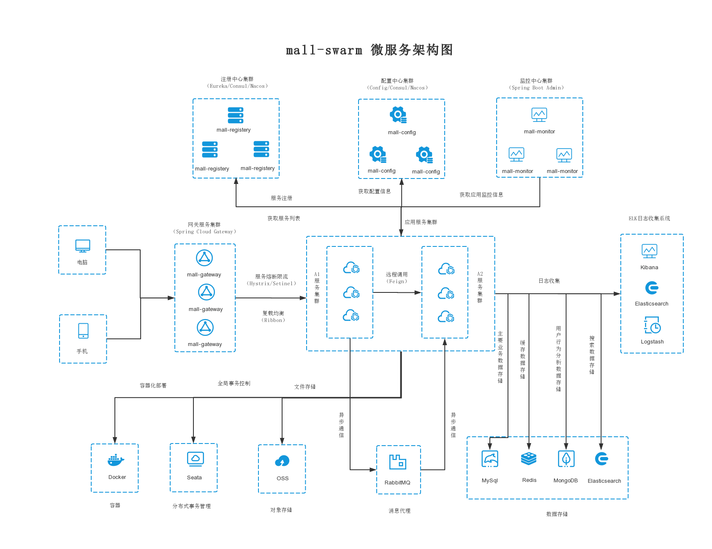
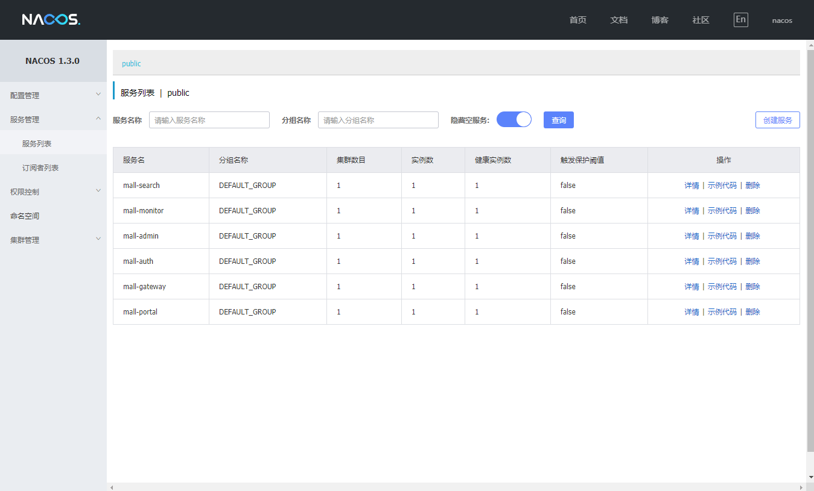
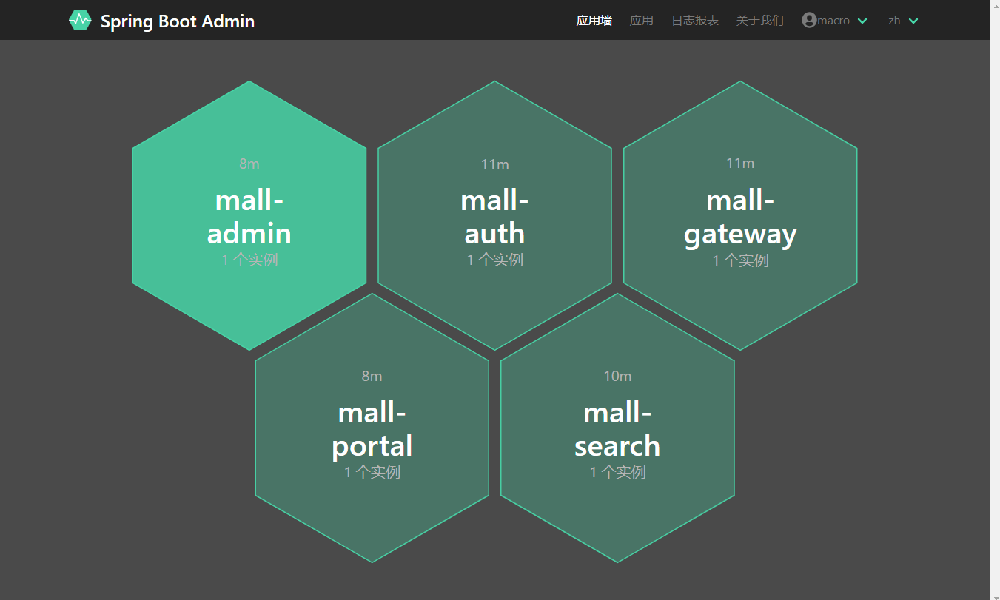
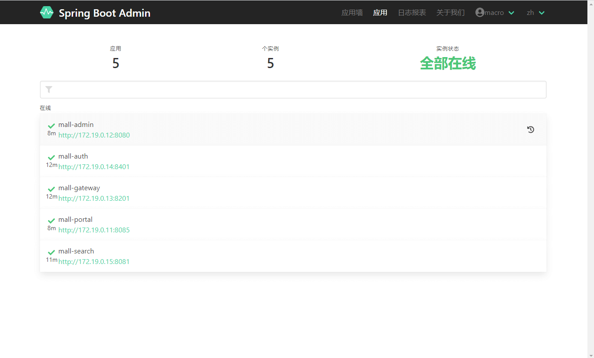
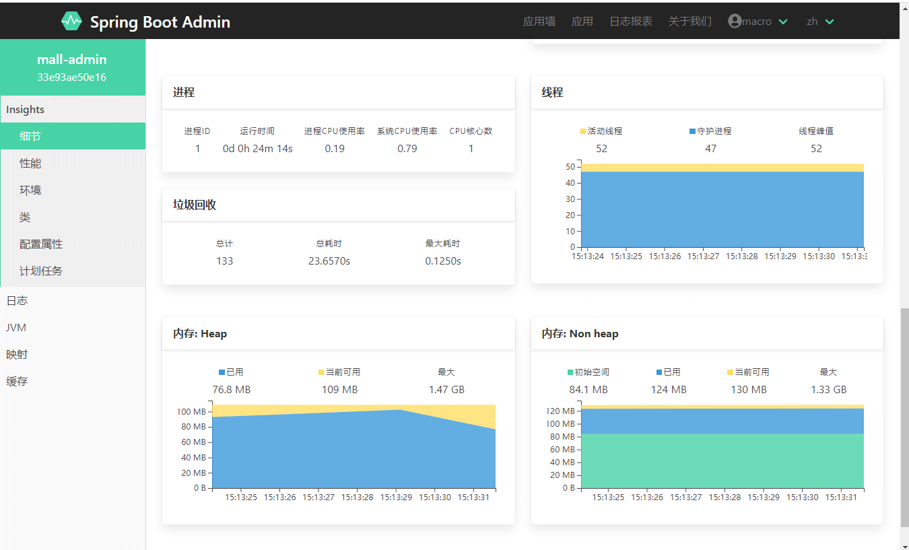
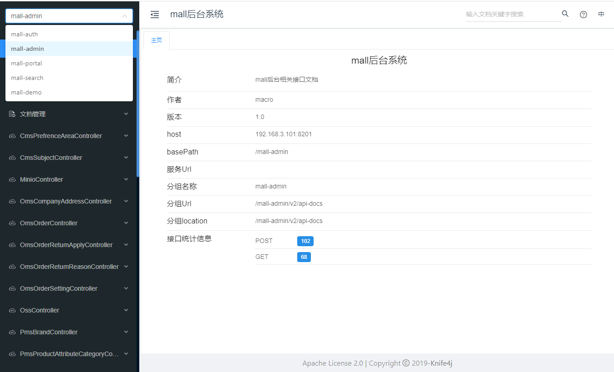
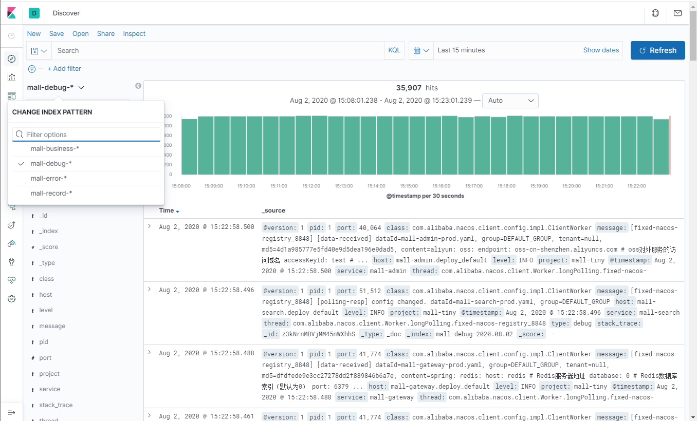
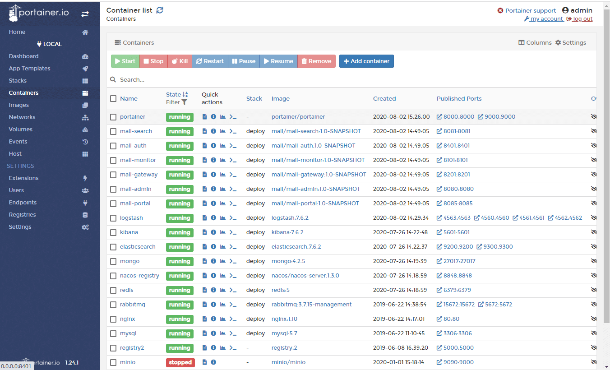
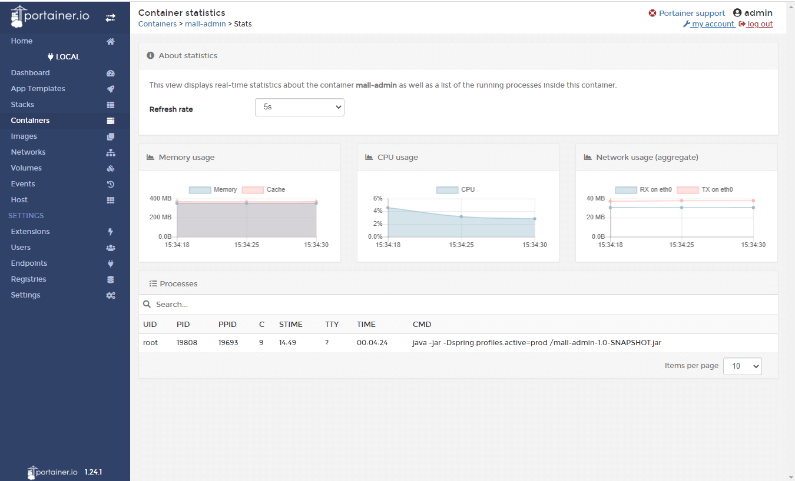

# mall-swarm

<p>
  <a href="#The Public"></a>
  <a href="https://github.com/kratos47mhs/mall"></a>
  <a href="https://github.com/kratos47mhs/mall-admin-web"></a>
  <a href="#The Public"></a>
</p>

## Project Introduction

`mall-swarm`is a microservice mall system，Adopted Spring Cloud Hoxton & Alibaba、Spring Boot 2.3、Oauth2、MyBatis、Docker、Core technologies such as Elasticsearch，At the same time, a Vue-based management Admin is provided to facilitate and quickly build the system.`mall-swarm`System functions such as registration center, configuration center, monitoring center and gateway are integrated on the basis of e-commerce business. The documentation is complete, with a full set of Spring Cloud tutorials.

## System architecture diagram



## Organizational structure

``` lua
mall
├── mall-common -- Tools and general code modules
├── mall-mbg -- Database operation code module generated by MyBatis Generator
├── mall-auth -- Unified authentication center based on Spring Security Oauth2
├── mall-gateway -- Microservice API gateway service based on Spring Cloud Gateway
├── mall-monitor -- Microservice monitoring center based on Spring Boot Admin
├── mall-admin -- Admin management system service
├── mall-search -- Product search system service based on Elasticsearch
├── mall-portal -- Portal mall system service
├── mall-demo -- Microservice remote call test service
└── config -- Configuration stored in the configuration center
```

## Project documentation

- Project documentation`mall`Tutorials：[http://www.macrozheng.com](https://macrozheng.github.io/mall-learning)
- Supporting`Spring Cloud`Tutorials：[https://github.com/macrozheng/springcloud-learning](https://github.com/macrozheng/springcloud-learning)

## Project demo

- Admin management system： [http://www.macrozheng.com/admin/index.html](http://www.macrozheng.com/admin/index.html)  
- Portal terminal mall system：[http://www.macrozheng.com/app/index.html](http://www.macrozheng.com/app/index.html)

## Technology selection

### Back-end technology

| technology             | Description                 | Official website                                                 |
| ---------------- | -------------------- | ---------------------------------------------------- |
| Spring Cloud           | Microservices framework           | https://spring.io/projects/spring-cloud              |
| Spring Boot            | Container + MVC framework         | https://spring.io/projects/spring-boot               |
| Spring Security Oauth2 | Authentication and authorization framework       | https://spring.io/projects/spring-security-oauth     |
| MyBatis                | ORM framework              | http://www.mybatis.org/mybatis-3/zh/index.html       |
| MyBatisGenerator       | Data layer code generation       | http://www.mybatis.org/generator/index.html          |
| PageHelper             | MyBatis physical paging plugin  | http://git.oschina.net/free/Mybatis_PageHelper       |
| Knife4j                | Document production tool         | https://github.com/xiaoymin/swagger-bootstrap-ui     |
| Elasticsearch          | search engine             | https://github.com/elastic/elasticsearch             |
| RabbitMq               | message queue             | https://www.rabbitmq.com/                            |
| Redis                  | Distributed cache           | https://redis.io/                                    |
| MongoDb                | NoSql database          | https://www.mongodb.com/                             |
| Docker                 | Application container engine         | https://www.docker.com/                              |
| Druid            | Database connection pool         | https://github.com/alibaba/druid                     |
| S3              | Object store             | https://github.com/aws/aws-sdk-java        |
| MinIO            | Object store             | https://github.com/minio/minio                       |
|Consul            |Discover services   |https://www.consul.io/docs/guides/containers-guide |
| JWT              | JWT login support          | https://github.com/jwtk/jjwt                         |
| LogStash         | Log collection             | https://github.com/logstash/logstash-logback-encoder |
| Lombok           | Simplified Object Packaging Tool     | https://github.com/rzwitserloot/lombok               |
| Seata            | Global transaction management framework     | https://github.com/seata/seata                       |
| Portainer        | Visual Docker container management | https://github.com/portainer/portainer               |
| Jenkins          | Automated deployment tools       | https://github.com/jenkinsci/jenkins                 |

### Front-end technology

| technology       | Description                  | Official website                           |
| ---------- | --------------------- | ------------------------------ |
| Vue        | Front-end framework              | https://vuejs.org/             |
| Vue-router | Routing framework              | https://router.vuejs.org/      |
| Vuex       | Global State Management Framework      | https://vuex.vuejs.org/        |
| Element    | Front-end UI framework            | https://element.eleme.io/      |
| Axios      | Front-end HTTP framework          | https://github.com/axios/axios |
| v-charts   | Charting framework based on Echarts | https://v-charts.js.org/       |

## Environment setup

### Development environment

| Tool          | Version | Download                                                         |
| ------------- | ------ | ------------------------------------------------------------ |
| JDK           | 1.8    | https://www.oracle.com/technetwork/java/javase/downloads/jdk8-downloads-2133151.html |
| Mysql         | 5.7    | https://www.mysql.com/                                       |
| Redis         | 5.0    | https://redis.io/download                                    |
| Elasticsearch | 7.8.0  | https://www.elastic.co/cn/downloads/elasticsearch            |
| Kibana        | 7.8.0  | https://www.elastic.co/cn/downloads/kibana                   |
| Logstash      | 7.8.0  | https://www.elastic.co/cn/downloads/logstash                 |
| MongoDb       | 4.2.5  | https://www.mongodb.com/download-center                      |
| RabbitMq      | 3.7.14 | http://www.rabbitmq.com/download.html                        |
| nginx         | 1.10   | http://nginx.org/en/download.html                            |

### Build steps

> Windows environment deployment

- Please refer to Windows environment setup：[mall-swarm deployment in Windows](http://www.macrozheng.com/#/deploy/mall_swarm_deploy_windows);
- `mall-admin-web`Please refer to the installation and deployment of the project：[Installation and deployment of mall front-end projects](http://www.macrozheng.com/#/deploy/mall_deploy_web);
- `ELK`Please refer to the construction of log collection system：[Spring Boot application integrates ELK to achieve log collection](http://www.macrozheng.com/#/technology/mall_tiny_elk);
- Use Min IO to store files, please refer to：[Front-end and back-end separation projects, how to elegantly realize file storage](http://www.macrozheng.com/#/technology/minio_use);
- Please refer to the read-write separation solution：[Are you still doing read-write separation in the code? Try this middleware](http://www.macrozheng.com/#/reference/gaea);
- `Distributed transaction`Please refer to the solution：[Use Seata to completely solve the distributed transaction problem in Spring Cloud!](http://www.macrozheng.com/#/cloud/seata);

> Docker environment deployment

- Please install CentOS7.6 using a virtual machine.：[Virtual machine installation and use of Linux，It's enough to watch this article！](https://github.com/macrozheng/mall-learning/blob/master/docs/reference/linux_install.md)
- Please refer to the installation of Docker environment：[Essential Docker commands for developers](https://github.com/macrozheng/mall-learning/blob/master/docs/reference/docker.md)；
- Please refer to this project Docker image build：[Building Docker images for SpringBoot applications with Maven plugin](https://github.com/macrozheng/mall-learning/blob/master/docs/reference/docker_maven.md)；
- Please refer to the deployment of this project under Docker container.：[mall-swarm deployment in Linux environment（Based on Docker container）](https://github.com/macrozheng/mall-learning/blob/master/docs/deploy/mall_swarm_deploy_docker.md)。
- This project uses Jenkins to automate：[Automated deployment under microservice architecture，Use Jenkins to achieve！](https://github.com/macrozheng/mall-learning/blob/master/docs/deploy/mall_swarm_deploy_jenkins.md)

## Running effect display

- View registration center service information, access address：http://192.168.3.101:8500/nacos/



- Monitoring center application information, access address：http://192.168.3.101:8101







- API document information, access address：http://192.168.3.101:8201



- Log collection system information, access address：http://192.168.3.101:5601



- Visual container management, access address：http://192.168.3.101:9000





## The Public

Mall project full set of learning tutorials are serialized, follow the official account「**macrozheng**」Get it the first time.

Add WeChat group to communicate, public account backstage reply「**Add group**」OK.


## Licence

[Apache License 2.0](https://github.com/kratos47mhs/mall-swarm/blob/master/LICENSE)

Copyright (c) 2018-2020 kratos47mhs