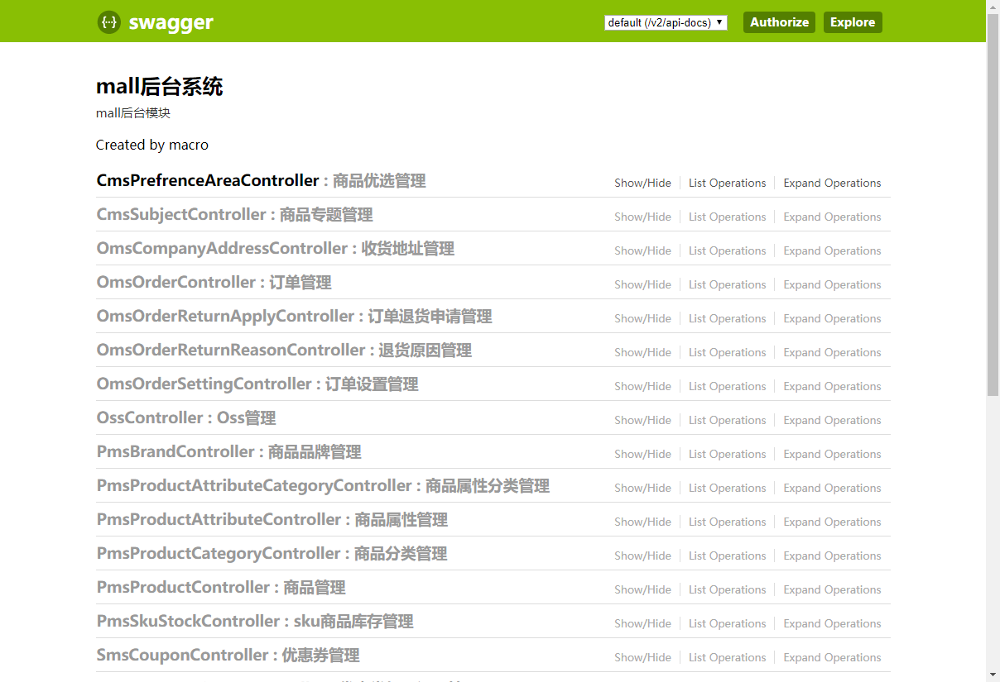
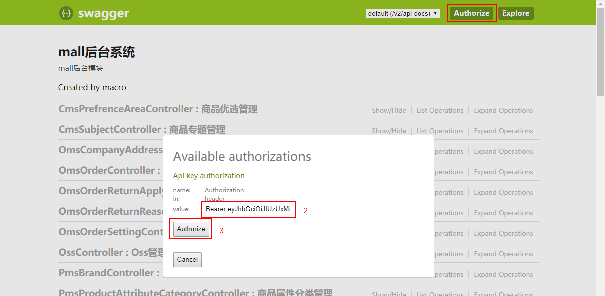
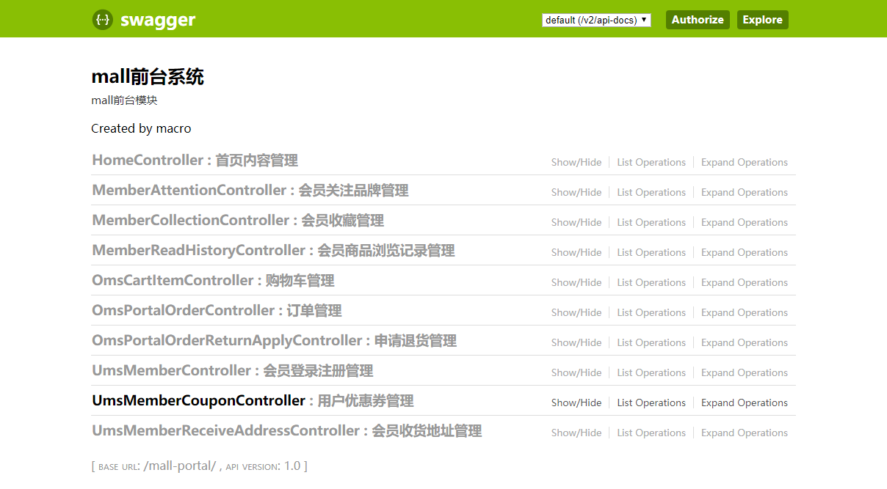
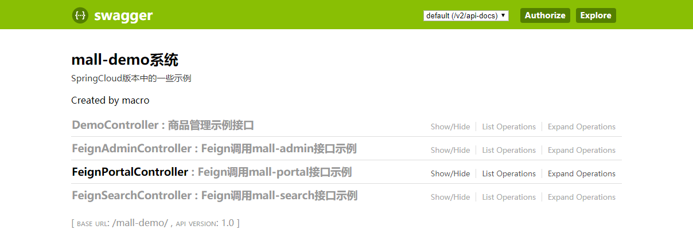
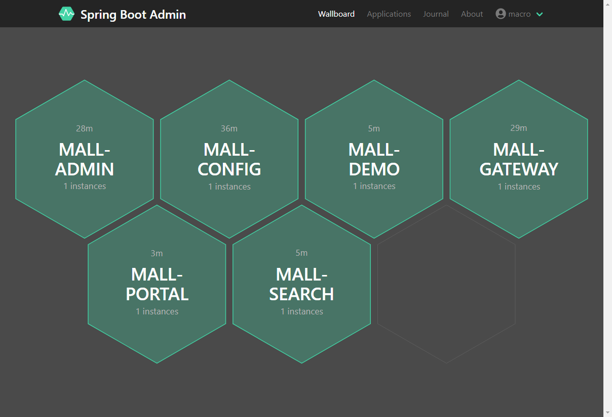
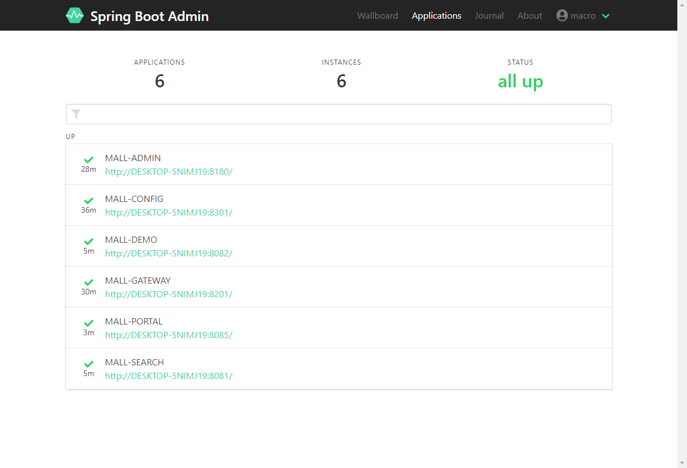
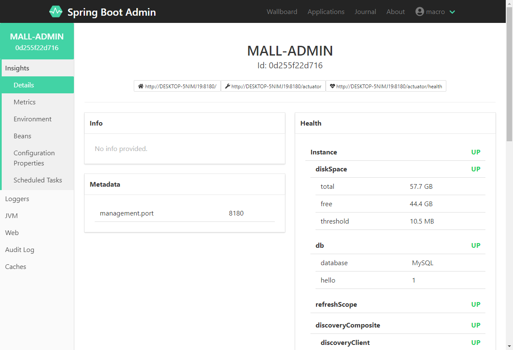
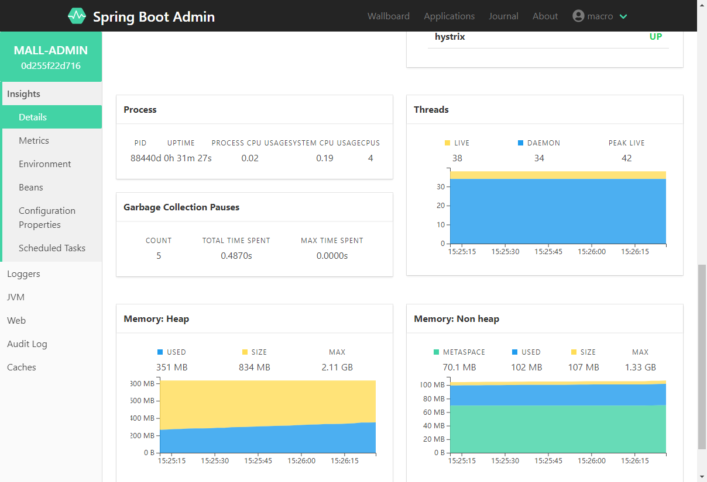

# mall-swarm deployment in Windows

## Develop Environment setup

> `The environment used in mall-swarm` is roughly the same as in the `mall` project. For details, see [mall deployment in a Windows environment.](https://github.com/macrozheng/mall-learning/blob/master/docs/deploy/mall_deploy_windows.md)。

Easy Environment setup process：

- Install IDEA and import the project source code；
- Install MySql, create a `mall` database, and import the` / document / sql / mall.sql` file；
- Install Redis, Elasticsearch, MongoDB, RabbitMQ and other environments。

## Project deployment

> `The mall-swarm` project starts in a sequential order, everyone should start in the following order.

### Start registry `mall-registory`

- Simply run the main function of com.macro.mall.MallRegistryApplication;
- After the operation is completed, you can view it through the registry console：http://localhost:8001

### Start the configuration center `mall-config`

- Just run the main function of com.macro.mall.MallConfigApplication；
- Visit the following interface to get the configuration information of mall-admin in the dev environment：http://localhost:8301/master/admin-dev.yml

### Start monitoring center `mall-monitor`

- Simply run the main function of com.macro.mall.MallMonitorApplication.；
- After the operation is completed, you can view it through the monitoring center console：http://localhost:8101
- Enter the account password `macro: 123456` to login and view.

### Start the gateway service`mall-gateway`

- Just run the main function of com.macro.mall.MallGatewayApplication.；
- Visit the following interface for dynamic routing rules：http://localhost:8201/actuator/gateway/routes

### Start background management service`mall-admin`

- Just run the main function of com.macro.mall.MallAdminApplication；
- Access interface documents through `mall-gateway` gateway service：http://localhost:8201/mall-admin/swagger-ui.html

- Login interface address：http://localhost:8201/mall-admin/admin/login
- After accessing the login interface and obtaining the token, put the authentication header information to access other interfaces that require login normally.：

### Start the foreground service`mall-portal`

- Just run the main function of com.macro.mall.portal.MallPortalApplication.；
- Access interface documents through `mall-gateway` gateway service：http://localhost:8201/mall-portal/swagger-ui.html

- Login interface address：http://localhost:8201/mall-portal/sso/login
- The method of calling the interface that needs to log in is the same`mall-admin`。

### Start search service`mall-search`

- Simply run the main function of com.macro.mall.search.MallSearchApplication;
-Access interface documentation via `mall-gateway` gateway service: http: // localhost: 8201 / mall-search / swagger-ui.html

! [] (../ resource / mall_swarm_windows_10.png)

### Start test service `mall-demo`

-Simply run the main function of com.macro.mall.MallAdminApplication;
-Access interface documentation via `mall-gateway` gateway service: http: // localhost: 8201 / mall-demo / swagger-ui.html

- You can test the remote call function using Feign by calling FeignAdminController, FeignPortalController, FeignSearchController.

## Show results

-Registry service information:

! [] (../ resource / mall_swarm_windows_01.png)

-Overview information of monitoring center services:

- Monitoring center single application details：

